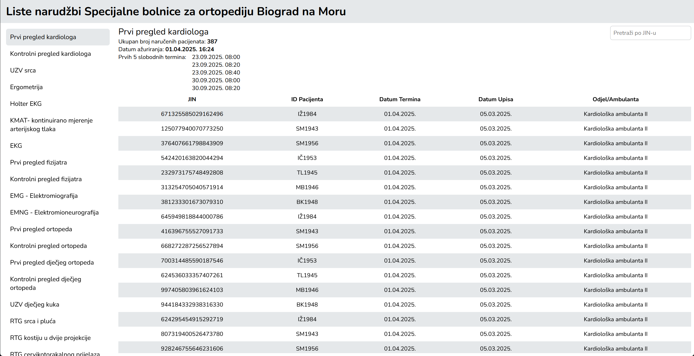
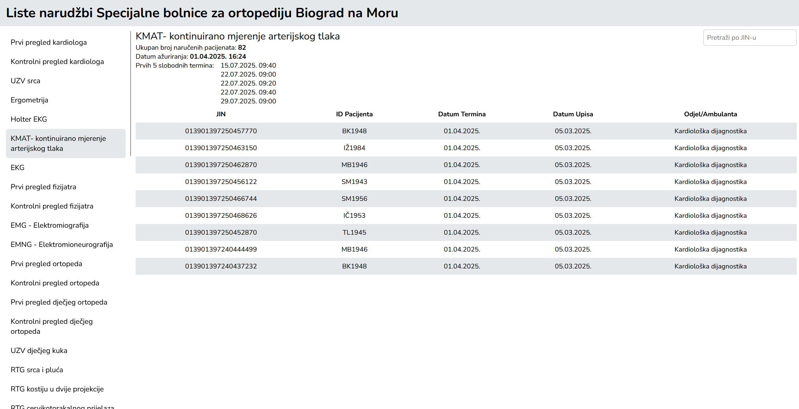
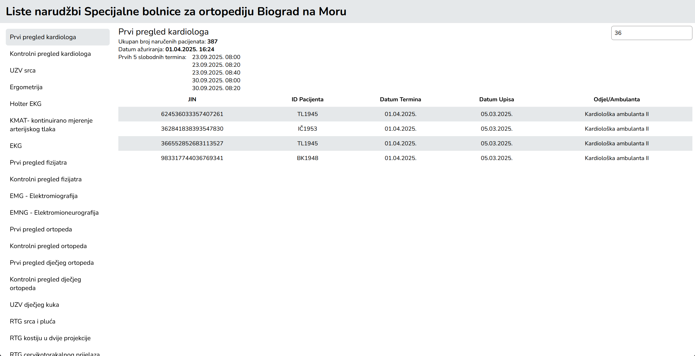

# Biograd Waiting List App


[](https://biograd-waiting-list.netlify.app)



A full-stack web application for viewing hospital procedures and their scheduled appointments.

The application displays medical procedures, basic information about each procedure, and the list of scheduled patients. Users can also search appointments by JIN.

# Live Demo

Frontend  
https://biograd-waiting-list.netlify.app

Backend API  
https://biograd-waiting-list.onrender.com

Note: The backend is hosted on the Render free tier, so the first request may take some time while the server wakes up.

---

# Project Inspiration

The idea for this project was inspired by the hospital waiting list system used by the Special Hospital for Orthopedics in Biograd na Moru.

The goal was to recreate a similar interface and functionality using React, Express and PostgreSQL.

Original system:  
https://lc.ortopedija-biograd.hr/

---

# Screenshots

### Overview


### Changing Procedure



### Search Appointments by JIN



---

# Features

- View a list of all procedures
- Display number of scheduled patients
- Show last update date
- Display first five available time slots
- View scheduled appointments for each procedure
- Search appointments by JIN
- Responsive layout
- Sticky table header
- Loading states

---

# Demo Data

For demonstration purposes, only the first few procedures contain scheduled appointments.

The remaining procedures are included to represent the full list of procedures but do not contain manually generated appointment data. Creating realistic schedules for every procedure would require a large amount of manual data entry and was outside the scope of this practice project.

---

# Tech Stack

Frontend

- React
- Zustand
- Axios
- CSS Modules
- Vite

Backend

- Node.js
- Express.js

Database

- PostgreSQL

Deployment

- Netlify (frontend)
- Render (backend + database)

---

# Project Structure

```bash
biograd-waiting-list/
├── backend/
│   ├── config/
│   ├── controllers/
│   ├── routes/
│   ├── seeds/
│   ├── server.js
│   └── package.json
├── frontend/
│   ├── src/
│   │   ├── components/
│   │   ├── store/
│   │   ├── App.jsx
│   │   └── main.jsx
│   ├── index.html
│   └── package.json
├── screenshots/
├── package.json
└── README.md
```

---

# Requirements

Before running the project locally you need:

- Node.js
- npm
- PostgreSQL

---

# Local Installation

Clone the repository

```bash
git clone https://github.com/jcelic/biograd-waiting-list.git
cd biograd-waiting-list
```

Install dependencies

```bash
npm run install-all
```

---

# Environment Variables

Create `.env` inside the **backend** folder

```env
PORT=3000
PG_USER=your_db_user
PG_HOST=localhost
PG_DATABASE=your_db_name
PG_PORT=5432
PG_PASSWORD=your_db_password
```

Create `.env` inside the **frontend** folder

```env
VITE_API_URL=http://localhost:3000
```

---

# Database Setup

Run the backend once so tables are created

```bash
npm run dev --prefix backend
```

Stop the server.

Seed the database

```bash
cd backend
node seeds/procedures.js
node seeds/appointments.js
cd ..
```

---

# Run the Application

Start frontend and backend together

```bash
npm start
```

---
